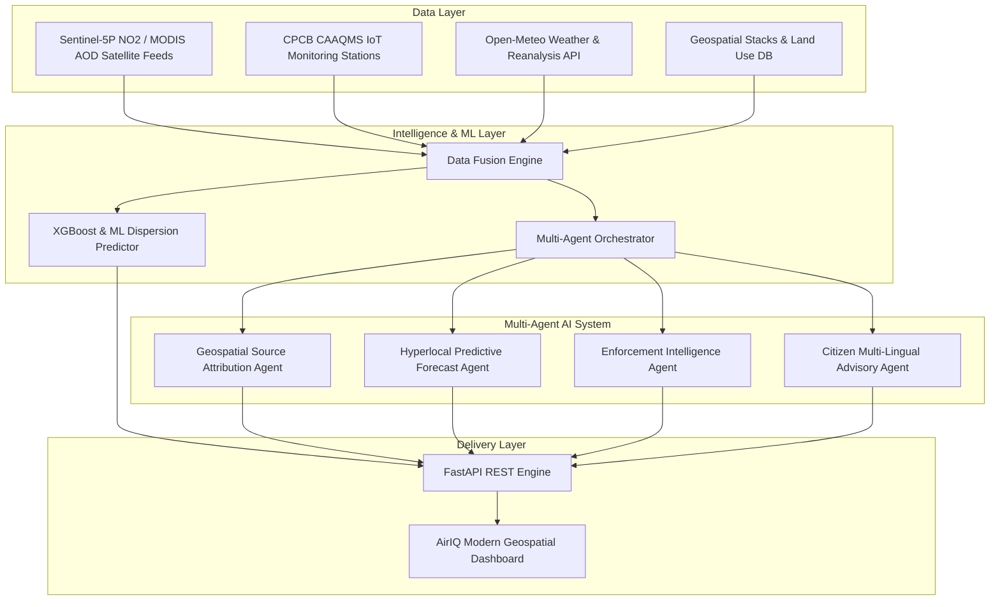

# AirIQ - System Architecture & Technical Specifications

AirIQ is a multi-modal, agentic AI platform designed to transform India's air quality management from reactive monitoring to evidence-backed, proactive source reduction.

## Specialized AI Agents Architecture

1. **Geospatial Pollution Source Attribution Engine**:
   - Analyzes spatial-temporal AQI patterns against land use maps, traffic density, construction permits, industrial stack sensor feeds, and satellite thermal anomaly spots.
   - Outputs ward-level source attribution percentage with statistical confidence scores.

2. **Hyperlocal Predictive AQI Forecasting Agent**:
   - Integrates meteorological forecasts, traffic cycles, seasonal emission calendars, and ML dispersion models.
   - Provides 24, 48, and 72-hour AQI forecasts at 1km grid resolution across city boundaries.

3. **Enforcement Intelligence & Prioritisation Agent**:
   - Correlates pollution hotspots with registered emission sources (industries, construction sites, waste burning locations, heavy diesel vehicle routes).
   - Generates prioritized, evidence-backed enforcement action tickets for municipal and SPCB flying squads.

4. **Citizen Health Risk Advisory System**:
   - Maps population vulnerability (schools, hospitals, outdoor workers, elderly) against forecast AQI.
   - Delivers multi-lingual regional advisories across 7 Indian languages (English, Hindi, Kannada, Tamil, Bengali, Marathi, Telugu) with web audio synthesis.
